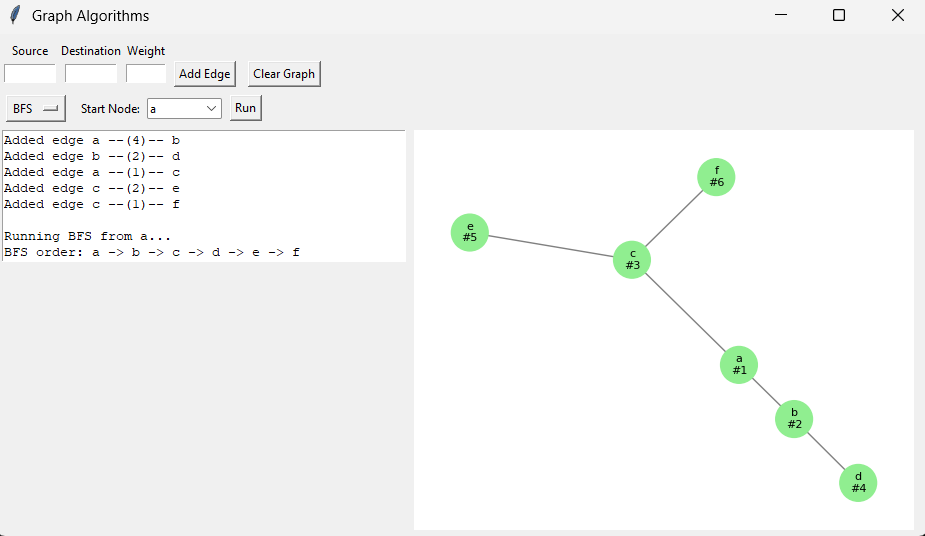
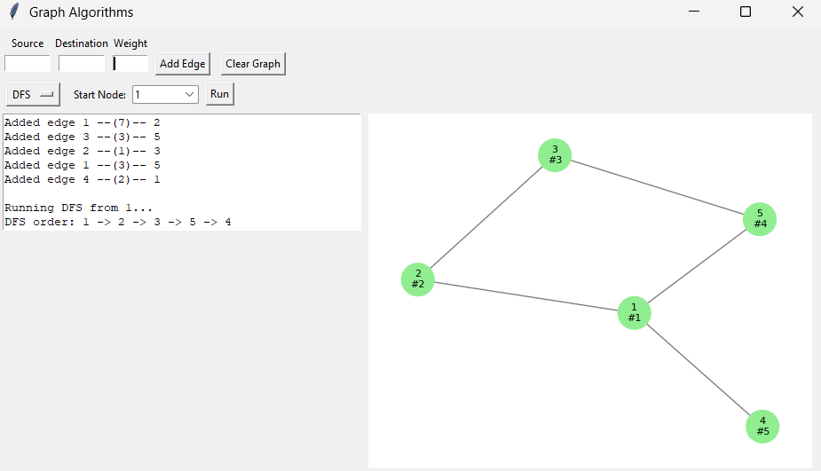
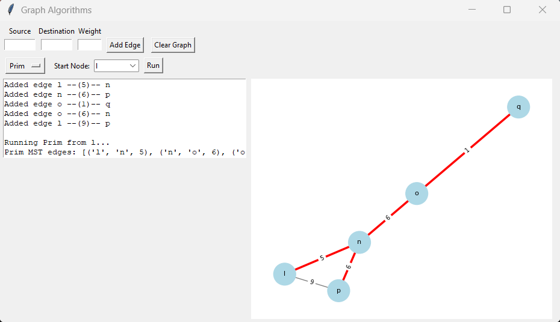
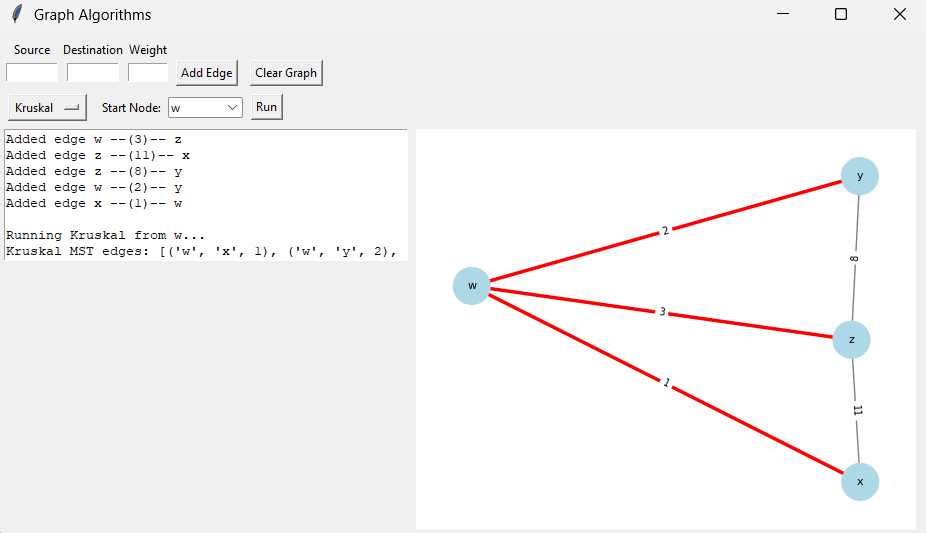

Graph Algorithums

This project is a Python GUI application built using Tkinter, NetworkX, and Matplotlib to help visualize how different graph algorithms work.

It allows you to:
Add nodes and weighted edges
Run BFS & DFS traversals
Generate MST using Prim’s and Kruskal’s
Visualize the graph dynamically with highlighted traversal paths
Understand how graph algorithms work step-by-step

🧠 Supported Algorithms

1️⃣ Breadth-First Search (BFS)
Explores layer-by-layer
Highlights visited nodes in order
Useful for shortest path in unweighted graphs

2️⃣ Depth-First Search (DFS)
Goes deep along a branch before backtracking
Highlights nodes in traversal sequence

3️⃣ Prim’s Minimum Spanning Tree
Builds MST starting from any node
Uses priority queue (min-heap)
Shows selected MST edges in red

4️⃣ Kruskal’s Minimum Spanning Tree
Sorts edges by weight
Uses Union–Find to avoid cycles
Shows MST edges visually

🛠 Features

✔ Add weighted edges easily
✔ Visual graph drawing using NetworkX
✔ Node highlighting based on traversal
✔ Edge highlighting for MST
✔ Clear text output view
✔ Simple and user-friendly interface

## 🖼️ Output Screenshots 

### Breadth-First-Search

### Depth-First Search

### Prim’s Minimum Spanning Tree

### Kruskal’s Minimum Spanning Tree

